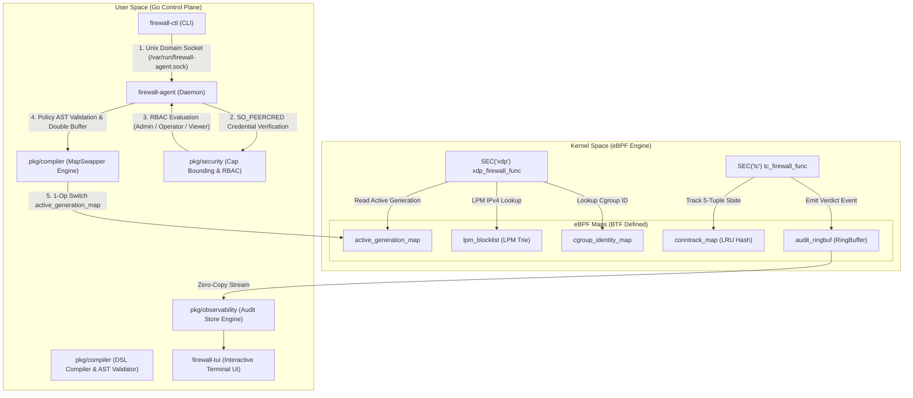

# Identity-Aware eBPF Firewall

[](https://golang.org)
[-FCC624?style=flat&logo=linux)](https://kernel.org)
[](https://clang.llvm.org)
[](ebpf-firewall-prd.md)

High-performance, in-kernel **Identity-Aware eBPF Firewall** engine featuring stateless XDP volumetric drop, TC stateful TCP conntrack, cgroup v2 identity resolution, double-buffered zero-drop atomic policy reloads, interactive Terminal UI (TUI), and Linux capability bounding with socket peer RBAC.

---

## Agenda & Table of Contents
1. [Executive Overview](#1-executive-overview)
2. [Prerequisites & System Requirements](#2-prerequisites--system-requirements)
3. [Feature Matrix](#3-feature-matrix)
4. [Deep-Dive Feature Breakdown](#4-deep-dive-feature-breakdown)
   - [Feature 1: Stateless L3/L4 XDP Volumetric Dropper](#feature-1-stateless-l3l4-xdp-volumetric-dropper)
   - [Feature 2: TC Stateful Conntrack & TCP State Machine](#feature-2-tc-stateful-conntrack--tcp-state-machine)
   - [Feature 3: Pluggable Cgroup v2 Identity Resolution](#feature-3-pluggable-cgroup-v2-identity-resolution)
   - [Feature 4: Policy DSL, Compiler & Double-Buffered Zero-Drop Atomic Swap](#feature-4-policy-dsl-compiler--double-buffered-zero-drop-atomic-swap)
   - [Feature 5: Real-Time Observability Engine & Interactive Bubbletea TUI](#feature-5-real-time-observability-engine--interactive-bubbletea-tui)
   - [Feature 6: Security Hardening, Capability Separation & Socket RBAC](#feature-6-security-hardening-capability-separation--socket-rbac)
5. [System Architecture](#5-system-architecture)
6. [Directory Structure & Project File Links](#6-directory-structure--project-file-links)
7. [Getting Started & Operator Guide](#7-getting-started--operator-guide)

---

## 1. Executive Overview
Modern cloud-native environments demand microsegmentation and high-throughput security enforcement without incurring standard Linux netfilter/iptables per-packet overhead.

This project delivers a multi-layered security engine implemented entirely in **eBPF (Extended Berkeley Packet Filter)** C programs and a Go control plane:
- **XDP Fast-Path**: Drops malicious volumetric floods directly in interface driver RX queues before `sk_buff` kernel allocation.
- **TC Stateful Tracking**: Enforces TCP 3-way handshakes and rejects untracked out-of-order packets.
- **Cgroup v2 Identity**: Maps 64-bit cgroup v2 numeric IDs to workload identity policies.
- **Zero-Drop Atomic Swaps**: Updates eBPF map generations atomically in a single operation without dropping continuous traffic streams.
- **Privilege Bounding & Socket RBAC**: Restricts daemon process capabilities (`CAP_BPF`, `CAP_NET_ADMIN`, `CAP_SYS_RESOURCE`) and enforces kernel-authenticated (`SO_PEERCRED`) role-based access control (`Admin`, `Operator`, `Viewer`).

---

## 2. Prerequisites & System Requirements

### Host Environment
- **Operating System**: Linux (Ubuntu 22.04 LTS / Debian 12 / RHEL 9 recommended).
- **Linux Kernel**: $\ge 5.10$ with **BTF** (BPF Type Format) enabled (`CONFIG_DEBUG_INFO_BTF=y`).
- **Permissions**: Root or `CAP_BPF` + `CAP_NET_ADMIN` privileges.

### Software Dependencies & Toolchains
| Tool / Library | Minimum Version | Purpose |
|---|---|---|
| **Go** | `1.26+` | Control plane binaries, compiler, loader, and TUI |
| **Clang / LLVM** | `18+` | Compiling eBPF C programs into BPF bytecode target (`-target bpf`) |
| **libbpf & libelf** | `1.0+` | Headers and ELF loader primitives |
| **bpftool** | `v7.0+` | eBPF map inspection, dumping, and debugging |
| **iproute2** | `latest` | Network namespace (`ip netns`) and `veth` pair provisioning |

---

## 3. Feature Matrix

| Feature | Subsystem | Kernel Hook / Primitive | Key Mechanism / Primary File |
|---|---|---|---|
| **Stateless Dropper** | L3/L4 Firewall | `SEC("xdp")` RX Hook | `BPF_MAP_TYPE_LPM_TRIE` in [xdp_firewall.c](bpf/xdp_firewall.c) |
| **Stateful Conntrack** | TCP Flow Tracker | `SEC("tc")` Ingress Hook | 5-Tuple LRU Hash in [tc_firewall.c](bpf/tc_firewall.c) |
| **Identity Resolution** | Workload Security | `bpf_get_current_cgroup_id()` | Inode lookup in [cgroup.go](pkg/identity/cgroup.go) |
| **Atomic Reload** | Control Plane | Generation Array Map | Double-buffered 1-op switch in [atomic_swap.go](pkg/compiler/atomic_swap.go) |
| **Observability TUI** | Monitoring Engine | `BPF_MAP_TYPE_RINGBUF` | 4-Pane HUD in [main.go](cmd/firewall-tui/main.go) |
| **Security Hardening** | Privilege Separation | `capset` / `SO_PEERCRED` | Capability bounding in [caps.go](pkg/security/caps.go) & RBAC in [rbac.go](pkg/security/rbac.go) |

---

## 4. Deep-Dive Feature Breakdown

### Feature 1: Stateless L3/L4 XDP Volumetric Dropper
- **Goal**: Drop volumetric denial-of-service traffic at wire-speed directly in interface driver RX queues before Linux network stack allocation (`sk_buff`).
- **Implementation**:
  - C Program: [xdp_firewall.c](bpf/xdp_firewall.c)
  - Headers: [common.h](bpf/headers/common.h) & [maps.h](bpf/headers/maps.h)
  - Map: `lpm_blocklist` (`BPF_MAP_TYPE_LPM_TRIE`) storing `struct lpm_key_ipv4`.
  - Statistics: `xdp_stats_map` (`BPF_MAP_TYPE_PERCPU_ARRAY`) tracking lock-free per-CPU packet and byte counters.
- **Workflow**:
  1. Driver receives packet on interface (`veth-s`).
  2. XDP program parses Ethernet and IPv4 headers with strict verifier safety bounds checks.
  3. Performs longest-prefix lookup in `lpm_blocklist`.
  4. On match, emits zero-copy `audit_event` to `audit_ringbuf` and returns `XDP_DROP`.

---

### Feature 2: TC Stateful Conntrack & TCP State Machine
- **Goal**: Enforce TCP state machine invariants and block out-of-order ACK/PSH flood attacks.
- **Implementation**:
  - C Program: [tc_firewall.c](bpf/tc_firewall.c)
  - Headers: [state_machine.h](bpf/headers/state_machine.h)
  - Map: `conntrack_map` (`BPF_MAP_TYPE_LRU_HASH`) storing bi-directional 5-tuple flow keys (`struct flow_key` $\rightarrow$ `struct flow_state`).
  - Userspace Mirror: [table.go](pkg/conntrack/table.go)
- **State Machine Transitions**:
  - **`TCP_STATE_SYN_SENT`**: First SYN packet creates forward and reverse flow entries.
  - **`TCP_STATE_ESTABLISHED`**: SYN-ACK / ACK handshake completion transitions flow to active state.
  - **`TCP_STATE_CLOSED`**: FIN / RST packet tears down flow and evicts map entry.
  - **Untracked Non-SYN Rejection**: Non-SYN packets for untracked flows are rejected immediately with `TC_ACT_SHOT` and reason code `REASON_UNTRACKED_NON_SYN` (`201`).

---

### Feature 3: Pluggable Cgroup v2 Identity Resolution
- **Goal**: Bind network firewall policies to Linux cgroup v2 container workloads without Kubernetes dependencies.
- **Implementation**:
  - C Helper: `bpf_get_current_cgroup_id()` inside [xdp_firewall.c](bpf/xdp_firewall.c).
  - Go Resolver: [cgroup.go](pkg/identity/cgroup.go) & [resolver.go](pkg/identity/resolver.go).
  - Map: `cgroup_identity_map` (`BPF_MAP_TYPE_HASH`).
- **Workflow**:
  1. Userspace `CgroupResolver` performs `syscall.Stat("/sys/fs/cgroup/workload")` to extract the 64-bit filesystem inode number (`stat.Ino`).
  2. Population: Inserts `(cgroup_id, rule_id)` into `cgroup_identity_map`.
  3. Kernel Enforcement: XDP program fetches `cgroup_id`, looks up map entry, and executes policy drop (`REASON_IDENTITY_DENY`).

---

### Feature 4: Policy DSL, Compiler & Double-Buffered Zero-Drop Atomic Swap
- **Goal**: Provide human-readable YAML policy definitions and allow zero-downtime policy reloads without dropping continuous packet streams.
- **Implementation**:
  - AST Parser & DSL Definition: [dsl.go](pkg/compiler/dsl.go)
  - AST Compiler & Validator: [compiler.go](pkg/compiler/compiler.go)
  - Atomic Swap Engine: [atomic_swap.go](pkg/compiler/atomic_swap.go)
- **Zero-Drop Atomic Reload Mechanics**:
  1. `active_generation_map` stores current generation index (e.g., `Gen 1`).
  2. `MapSwapper` compiles new AST and stages new rules under `nextGen = 2` into eBPF maps while kernel continues executing `Gen 1`.
  3. 1-Op Switch: Atomically updates `active_generation_map[0] = 2`.
  4. Post-Swap Cleanup: Purges stale `Gen 1` rules.
  5. Automatic Rollback: If staging fails, `active_generation_map` remains on `Gen 1` safely.

---

### Feature 5: Real-Time Observability Engine & Interactive Bubbletea TUI
- **Goal**: Provide instant visual explainability for every packet drop and pass verdict across the system.
- **Implementation**:
  - Ring Consumer: [ringbuf.go](pkg/observability/ringbuf.go)
  - AuditStore & Explainability Engine: [audit.go](pkg/observability/audit.go)
  - TUI Dashboard: [main.go](cmd/firewall-tui/main.go)
- **Dashboard Panes**:
  - **Pane 1**: Live PPS (Packets Per Second) sparkline metrics.
  - **Pane 2**: Active Conntrack Flow Table & Generation-Indexed Kernel Rules.
  - **Pane 3**: Real-Time Verdict Audit Stream with color-coded tags (`[PASS]`, `[DROP]`).
  - **Pane 4**: Cyber-HUD Event Inspector detailing Rule ID, Reason String, Cgroup Path, and Byte Count.

---

### Feature 6: Security Hardening, Capability Separation & Socket RBAC
- **Goal**: Protect the daemon against exploit escalation and lock down the control plane IPC socket against unauthorized tampering.
- **Implementation**:
  - Capability Inspection & Bounding: [caps.go](pkg/security/caps.go)
  - Socket Peer Credentials: [peercred.go](pkg/security/peercred.go)
  - RBAC Permission Matrix: [rbac.go](pkg/security/rbac.go)
  - Control Server IPC Hardening: [server.go](pkg/control/server.go)
  - Control CLI Integration: [main.go](cmd/firewall-ctl/main.go)
- **Security Invariants**:
  - **Capability Bounding**: Drops root capabilities (`CAP_SYS_ADMIN`, `CAP_SYS_RAWIO`) down to minimal required set: `CAP_BPF`, `CAP_NET_ADMIN`, `CAP_SYS_RESOURCE`.
  - **Kernel Authentication**: Extracts socket caller process `UID`, `GID`, `PID` using Linux `SO_PEERCRED` (`unix.GetsockoptUcred`).
  - **RBAC Matrix**:
    - **`RoleAdmin`** (UID 0 / `sudo`): Full access (`apply_policy`, `get_status`, `dump_maps`).
    - **`RoleOperator`**: Authorized deployment accounts (`apply_policy`, `get_status`, `dump_maps`).
    - **`RoleViewer`** (Standard users UID 1000): Read-only access (`get_status`, `dump_maps`). Rejected on `apply_policy` with `403 Forbidden`.

---

## 5. System Architecture



---

## 6. Directory Structure & Project File Links

Below is the directory hierarchy with direct relative repository links:

- **Kernel eBPF Programs (`bpf/`)**:
  - [xdp_firewall.c](bpf/xdp_firewall.c) — XDP L3/L4 Volumetric Dropper & Cgroup Identity Filter.
  - [tc_firewall.c](bpf/tc_firewall.c) — TC Stateful Conntrack Classifier & TCP State Machine.
  - [headers/common.h](bpf/headers/common.h) — Verdicts, reason codes, 5-tuple keys, `audit_event` struct.
  - [headers/maps.h](bpf/headers/maps.h) — BTF map helper definitions.
  - [headers/state_machine.h](bpf/headers/state_machine.h) — TCP state constants and flag checkers.
  - [headers/bpf_endian.h](bpf/headers/bpf_endian.h) — Byte order conversion macros.

- **Executable Entrypoints (`cmd/`)**:
  - [firewall-agent/main.go](cmd/firewall-agent/main.go) — Main control plane daemon & BPF loader.
  - [firewall-ctl/main.go](cmd/firewall-ctl/main.go) — Control CLI tool for rule updates & map queries.
  - [firewall-tui/main.go](cmd/firewall-tui/main.go) — 4-Pane interactive terminal UI dashboard.
  - [pktgen/main.go](cmd/pktgen/main.go) — Raw socket packet generator & test injector.

- **Go Subsystems (`pkg/`)**:
  - [pkg/bpf/loader.go](pkg/bpf/loader.go) — Program attachment, link management, map updates.
  - [pkg/compiler/dsl.go](pkg/compiler/dsl.go) — YAML policy AST structure definitions.
  - [pkg/compiler/compiler.go](pkg/compiler/compiler.go) — Policy AST validation & map key compilation.
  - [pkg/compiler/atomic_swap.go](pkg/compiler/atomic_swap.go) — Generation-indexed double-buffer `MapSwapper`.
  - [pkg/conntrack/table.go](pkg/conntrack/table.go) — Userspace conntrack flow mirror.
  - [pkg/identity/cgroup.go](pkg/identity/cgroup.go) — Cgroup v2 inode resolver (`syscall.Stat`).
  - [pkg/observability/ringbuf.go](pkg/observability/ringbuf.go) — Zero-copy ring buffer reader.
  - [pkg/observability/audit.go](pkg/observability/audit.go) — `AuditStore` circular buffer & explainability string formatters.
  - [pkg/security/caps.go](pkg/security/caps.go) — Linux process capability inspection & privilege separation bounding.
  - [pkg/security/peercred.go](pkg/security/peercred.go) — `SO_PEERCRED` socket peer credential extraction.
  - [pkg/security/rbac.go](pkg/security/rbac.go) — Role-Based Access Control matrix & permission evaluator.

- **Test Suites & Documentation**:
  - [test/e2e/phase1_test.go](test/e2e/phase1_test.go) — Phase 1 XDP Dropper E2E test.
  - [test/e2e/phase2_test.go](test/e2e/phase2_test.go) — Phase 2 TC Stateful Conntrack E2E test.
  - [test/e2e/phase3_test.go](test/e2e/phase3_test.go) — Phase 3 Cgroup Identity Resolution E2E test.
  - [test/e2e/phase4_test.go](test/e2e/phase4_test.go) — Phase 4 Zero-Drop Atomic Reload E2E test.
  - [test/e2e/phase5_test.go](test/e2e/phase5_test.go) — Phase 5 AuditStore & Filtering E2E test.
  - [test/e2e/phase6_test.go](test/e2e/phase6_test.go) — Phase 6 Security & RBAC E2E test.
  - [Makefile](Makefile) — Build, test, netns & debug automation.
  - [project_plan.md](project_plan.md) — Phased production execution plan & milestones.
  - [journal.md](journal.md) — Cumulative technical engineering journal.

---

## 7. Getting Started & Operator Guide

### 1. Build eBPF Bytecode & Executables
Generate `bpf2go` bindings and compile all binaries into `bin/`:

```bash
# Check dependencies (clang, go, iproute2)
make deps

# Compile eBPF programs and Go binaries
make build
```

---

### 2. Provision Test Environment (Network Namespaces)
Provision the isolated `client` (`10.0.0.1`) $\leftrightarrow$ `server` (`10.0.0.2`) network namespace topology connected via `veth-s`:

```bash
make netns-up
```

---

### 3. Run Firewall Agent
In **Terminal 1**, run the firewall agent inside the `server` network namespace:

```bash
make run-agent
```

**Log Output:**
```text
[+] Starting eBPF Firewall Agent on interface 'veth-s'...
[SECURITY] Checking process capabilities (UID: 0, Root: true)...
[SECURITY] Privilege separation applied: bounded process to minimal capabilities (CAP_BPF, CAP_NET_ADMIN, CAP_SYS_RESOURCE).
[+] Control Plane IPC server listening on unix socket: /var/run/firewall-agent.sock
[+] Firewall agent operational (XDP + TC Conntrack + Control Server active).
```

---

### 4. Manage Firewall via Control CLI (`firewall-ctl`)
In **Terminal 2**, manage rules and inspect status:

```bash
# Query agent status
make ctl-status

# Apply updated YAML policy atomically
make ctl-apply POLICY=configs/rules_updated.yaml

# Dump active generation BPF map rules
make ctl-dump
```

---

### 5. Launch Interactive Observability Dashboard (TUI)
In **Terminal 3**, launch the real-time `firewall-tui` dashboard:

```bash
make tui
```

- Press `Tab` to switch focus between sparkline, conntrack table, audit stream, and inspector HUD.
- Press `/` to enter text search filter.
- Press `q` or `Ctrl+C` to exit.

---

### 6. Run Complete Automated Test Suite
Execute unit tests and E2E netns integration test suites across all phases:

```bash
# Run Phase 6 Capability & RBAC Test Suite
make test-phase6

# Run Phase 5 Observability Test Suite
make test-phase5

# Run Phase 4 Atomic Reload Test Suite
make test-phase4
```

---

### 7. Clean Up Environment
Teardown network namespaces and remove compiled binaries:

```bash
make clean
```
